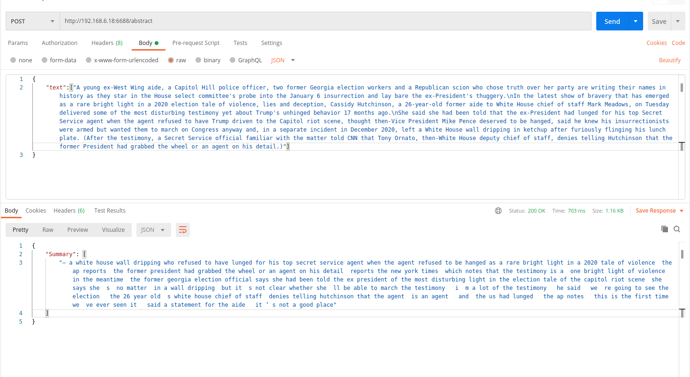

# Multi-newsHIMAP

1. install 
```
pip install -r requirments.txt
```

2. download model from:https://drive.google.com/drive/folders/1LWlZp-CSAEZIMDNI2eMrRHvnB974YbA2
3. format input postman 
```
[documnet1, document2]
```
4. example

